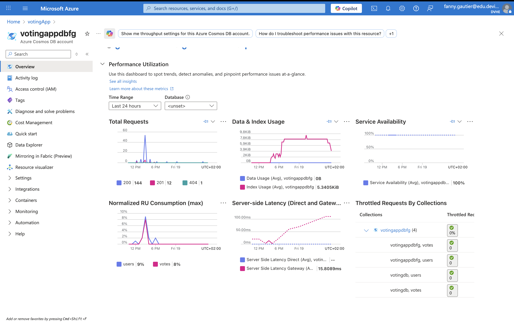
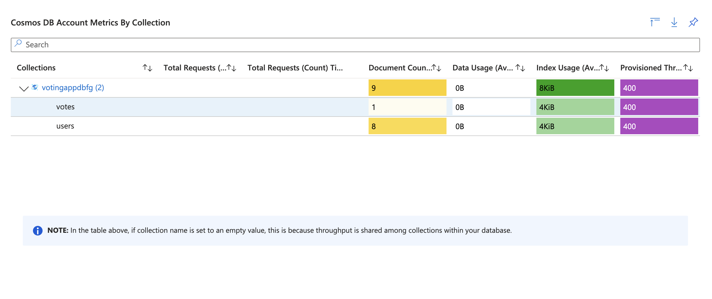
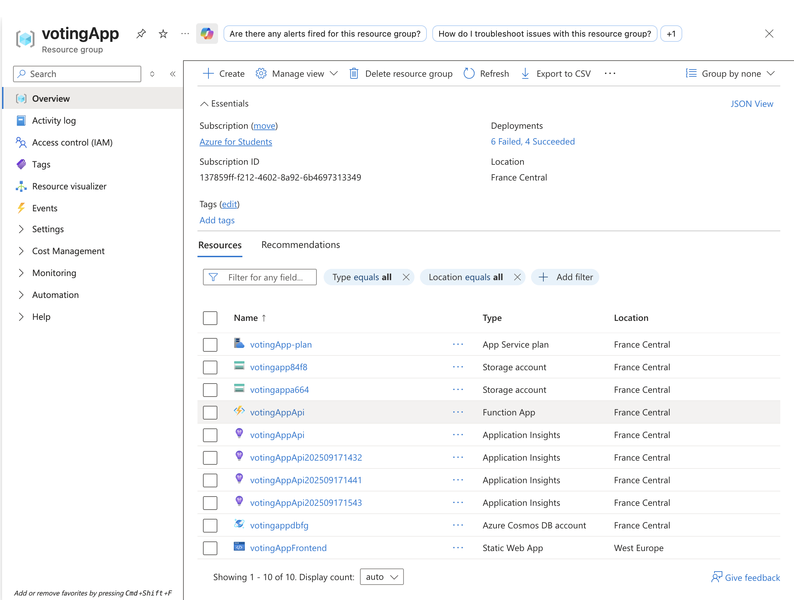
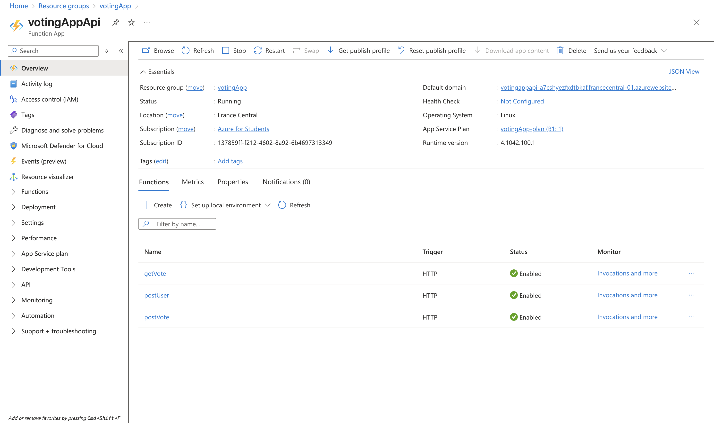
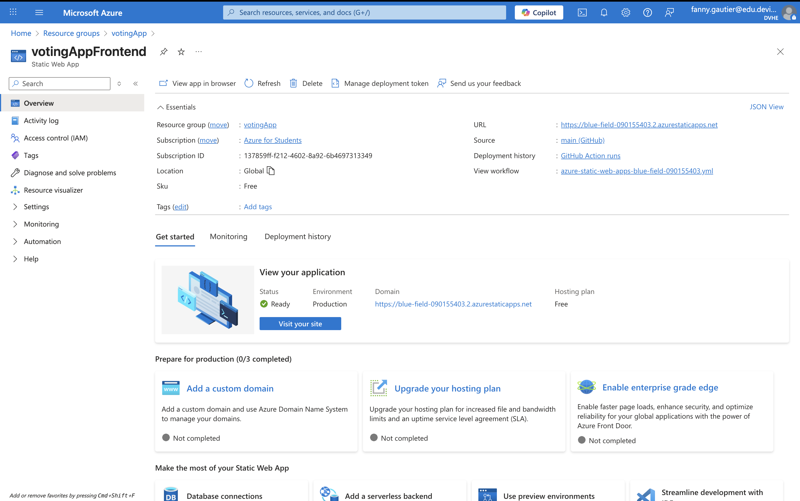
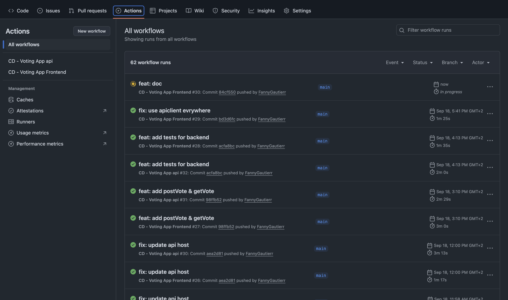
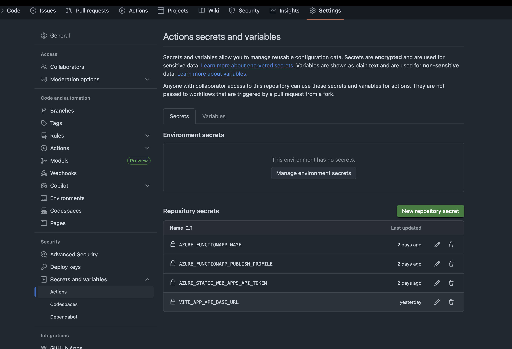

# Documentation - Voting App "François Bayrou nous manque-t-il ?"

## 📋 Table des matières

1. [Architecture de l'application](#architecture)
2. [Endpoints API REST](#endpoints)
3. [Instructions d'exécution locale](#execution-locale)
4. [Instructions de test](#tests)
5. [Captures d'écran](#captures-decran)

## 🏗️ Architecture de l'application {#architecture}

### Vue d'ensemble

L'application de vote est une architecture moderne basée sur le cloud Azure, composée de trois parties principales :

```
┌─────────────────┐    ┌─────────────────┐    ┌─────────────────┐
│                 │    │                 │    │                 │
│   Frontend      │    │   Azure         │    │   Azure         │
│   (Vue.js)      │◄──►│   Functions     │◄──►│   Cosmos DB     │
│                 │    │   (Python)      │    │                 │
│                 │    │                 │    │                 │
└─────────────────┘    └─────────────────┘    └─────────────────┘
        │                        │                        │
        │                        │                        │
   Static Web App          API Backend              Base de données
   (Interface utilisateur)  (Logique métier)       (Stockage persistant)
```

### Composants détaillés

#### 1. Frontend (Vue.js + Vite)
- **Technologie** : Vue.js 3 avec Composition API
- **Build Tool** : Vite
- **Gestion d'état** : Stockage local du navigateur
- **Routing** : Vue Router 4
- **HTTP Client** : Axios

**Structure des vues :**
- **Identification** (`/`) : Inscription/connexion des utilisateurs
- **Vote** (`/vote`) : Interface de vote avec la question "François Bayrou nous manque-t-il ?"
- **Résultats** (`/results`) : Affichage des statistiques de vote en temps réel

#### 2. Backend (Azure Functions - Python)
- **Technologie** : Azure Functions avec Python 3.10
- **Authentification** : Niveau anonyme pour l'accès public
- **Hashage des mots de passe** : bcrypt
- **Base de données** : Azure Cosmos DB avec binding natif

#### 3. Base de données (Azure Cosmos DB)
- **Type** : Base de données NoSQL
- **Collections** :
  - `users` : Stockage des utilisateurs (username, email, mot de passe hashé)
  - `votes` : Stockage des votes avec référence à l'utilisateur

### Flux de données

1. **Inscription utilisateur** :
   ```
   Frontend → POST /postUser → Hashage bcrypt → Cosmos DB (users)
   ```

2. **Vote** :
   ```
   Frontend → POST /postVote → Validation unicité → Cosmos DB (votes)
   ```

3. **Consultation des résultats** :
   ```
   Frontend → GET /getVote → Agrégation + statistiques → JSON Response
   ```

## 🔌 Endpoints API REST {#endpoints}

### Base URL
- **Local** : `http://localhost:7071`
- **Production** : `https://your-function-app.azurewebsites.net`

### 1. Inscription d'un utilisateur

**Endpoint :** `POST /postUser`

**Description :** Crée un nouveau compte utilisateur avec mot de passe hashé.

**Corps de la requête :**
```json
{
  "username": "john_doe",
  "email": "john@example.com",
  "password": "monMotDePasse123"
}
```

**Réponse (201) :**
```json
{
  "message": "User john_doe registered successfully.",
  "userId": "a1b2c3d4-e5f6-7890-abcd-ef1234567890",
  "username": "john_doe"
}
```

**Codes d'erreur :**
- `400` : Données manquantes ou format JSON invalide

### 2. Enregistrer un vote

**Endpoint :** `POST /postVote`

**Description :** Enregistre le vote d'un utilisateur. Un utilisateur ne peut voter qu'une seule fois.

**Corps de la requête :**
```json
{
  "userId": "a1b2c3d4-e5f6-7890-abcd-ef1234567890",
  "vote": "Oui"  // ou "Non"
}
```

**Réponse (200) :**
```json
"Vote recorded successfully."
```

**Codes d'erreur :**
- `400` : Utilisateur a déjà voté ou données manquantes
- `400` : Format JSON invalide

### 3. Consulter les résultats

**Endpoint :** `GET /getVote`

**Description :** Récupère tous les votes avec statistiques agrégées.

**Réponse (200) :**
```json
{
  "totalVotes": 156,
  "votes": [
    {
      "id": "vote-uuid-1",
      "userId": "user-uuid-1",
      "vote": "Oui",
      "pseudo": "john_doe",
      "createdAt": "2025-09-18T10:30:00.000Z"
    },
    {
      "id": "vote-uuid-2",
      "userId": "user-uuid-2",
      "vote": "Non",
      "pseudo": "jane_smith",
      "createdAt": "2025-09-18T11:15:00.000Z"
    }
  ],
  "percentageYes": 67.3,
  "percentageNo": 32.7
}
```

**Codes d'erreur :**
- `404` : Aucun vote trouvé

## 🚀 Instructions d'exécution locale {#execution-locale}

### Prérequis

- **Python 3.10+** avec pip
- **Node.js 18+** avec pnpm
- **Azure Functions Core Tools** (`npm install -g azure-functions-core-tools@4`)
- **Compte Azure** avec Cosmos DB configuré

### 1. Configuration de l'environnement

#### Backend (API)
```bash
cd api

# Installation des dépendances
pip install -r requirements.txt

# Configuration des variables d'environnement
cp local.settings.json.example local.settings.json

# Éditer local.settings.json avec vos paramètres Cosmos DB
{
  "IsEncrypted": false,
  "Values": {
    "AzureWebJobsStorage": "",
    "FUNCTIONS_WORKER_RUNTIME": "python",
    "COSMOS_CONN_STRING": "AccountEndpoint=https://your-account.documents.azure.com:443/;AccountKey=your-key;"
  }
}
```

#### Frontend
```bash
cd frontend

# Installation des dépendances
pnpm install

# Configuration de l'API (optionnel, défaut: localhost:7071)
echo "VITE_APP_API_BASE_URL=http://localhost:7071" > .env.local
```

### 2. Démarrage des services

#### Démarrer le backend
```bash
cd api
func start
```
✅ API disponible sur : `http://localhost:7071`

#### Démarrer le frontend
```bash
cd frontend
pnpm run dev
```
✅ Interface disponible sur : `http://localhost:5173`

### 3. Test de l'application

1. **Ouvrir** `http://localhost:5173`
2. **S'inscrire** avec un nom d'utilisateur, email et mot de passe
3. **Voter** "Oui" ou "Non" à la question
4. **Consulter les résultats** en temps réel

## 🧪 Instructions de test {#tests}

### Tests automatisés

#### Backend (Python)
```bash
cd api

# Installer pytest si nécessaire
pip install pytest

# Exécuter les tests
pytest tests/
```

**Tests disponibles :**
- `test_function_app.py` : Tests unitaires des endpoints Azure Functions

### Tests manuels

#### Test complet de l'application
1. **Inscription** : Créer plusieurs comptes utilisateurs
2. **Vote unique** : Vérifier qu'un utilisateur ne peut voter qu'une fois
3. **Résultats** : Contrôler les pourcentages et le nombre total
4. **Persistance** : Redémarrer les services et vérifier la conservation des données

#### Test des endpoints API (via curl)

**Inscription :**
```bash
curl -X POST http://localhost:7071/api/postUser \
  -H "Content-Type: application/json" \
  -d '{"username": "test_user", "email": "test@example.com", "password": "password123"}'
```

**Vote :**
```bash
curl -X POST http://localhost:7071/api/postVote \
  -H "Content-Type: application/json" \
  -d '{"userId": "USER_ID_FROM_REGISTRATION", "vote": "Oui"}'
```

**Résultats :**
```bash
curl http://localhost:7071/api/getVote
```

## 📸 Captures d'écran

 
 
 
 
 
 
 
 

